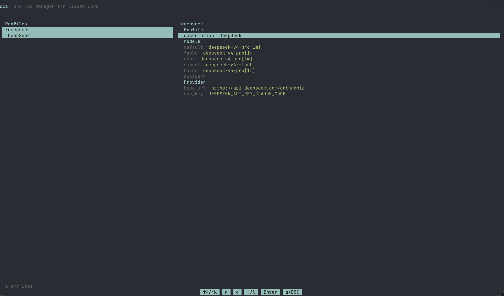

# ccs

Claude Code Profile Switcher.  
Manage grouped profiles for different API proxy services (sub2api) — switch providers, models, and credentials via a terminal UI.



## Install

Recommend via mise:
```bash
mise use -g github:lywa1998/ccs@latest
```

Or via cargo-binstall:
```bash
cargo binstall --git https://github.com/lywa1998/ccs.git ccs
```

Or via cargo:
```bash
cargo install --git https://github.com/lywa1998/ccs.git
```

## Usage

```bash
ccs              # open the TUI profile picker
ccs <profile>    # launch directly with a profile
```

### Keybindings

| Key | Context | Action |
|-----|---------|--------|
| `↑` `↓` / `j` `k` | Left panel | Navigate profiles |
| `Enter` | Left panel | Select profile & launch Claude |
| `n` | Left panel | Create new profile |
| `d` | Left panel | Delete selected profile |
| `→` / `l` | Left panel | Focus right panel (edit fields) |
| `←` / `h` | Right panel | Focus left panel |
| `↑` `↓` / `j` `k` | Right panel | Navigate fields |
| `Enter` | Right panel | Edit selected field |
| `Enter` | Editing | Confirm & save |
| `Esc` | Editing / Creating | Cancel |
| `q` / `Esc` / `Ctrl-c` | Global | Quit |

## Configuration

Profiles are defined in `~/.config/ccs/config.toml`:

```toml
# Direct Anthropic subscription — no extra config needed.
# Models and provider are optional; Claude Code built-in defaults apply.
[profiles.anthropic]
description = "Anthropic"

# Proxy / third-party API — override models and endpoint.
[profiles.deepseek]
description = "DeepSeek"

[profiles.deepseek.models]
default = "deepseek-v4-pro[1m]"
default_fable = "deepseek-v4-pro[1m]"

[profiles.deepseek.provider]
base_url = "https://api.deepseek.com/anthropic"
env_key = "DEEPSEEK_API_KEY_CLAUDE_CODE"
```

### Model fields

All model fields are optional. Unset fields are simply not passed to Claude Code, so its built-in defaults apply.

| Field | Environment variable | Purpose |
|-------|---------------------|---------|
| `default` | `ANTHROPIC_MODEL` | 主模型 |
| `default_fable` | `ANTHROPIC_DEFAULT_FABLE_MODEL` | Fable 5，用于自动模型回退 |
| `default_opus` | `ANTHROPIC_DEFAULT_OPUS_MODEL` | 用于 opus，或 Plan Mode 活跃时的 opusplan |
| `default_sonnet` | `ANTHROPIC_DEFAULT_SONNET_MODEL` | 用于 sonnet，或 Plan Mode 不活跃时的 opusplan |
| `default_haiku` | `ANTHROPIC_DEFAULT_HAIKU_MODEL` | 用于 haiku 及后台功能 |
| `subagent` | `CLAUDE_CODE_SUBAGENT_MODEL` | 用于所有 subagents 和 agent teams，设为 `inherit` 使用常规模型解析 |

### Provider fields

| Field | Environment variable | Purpose |
|-------|---------------------|---------|
| `base_url` | `ANTHROPIC_BASE_URL` | API endpoint URL |
| `env_key` | — | Name of the env var that holds the API key |

## License

MIT
